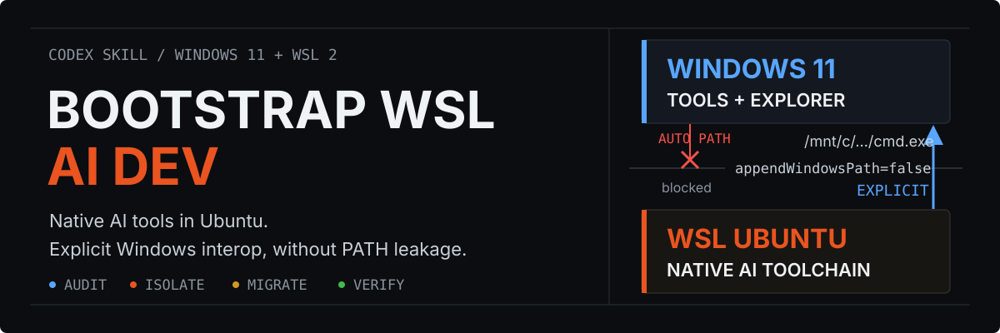
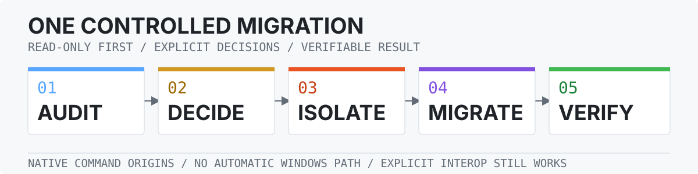

<h1 align="center">
  
</h1>

<p align="center">
  <a href="https://github.com/CaoLiangqiang/bootstrap-wsl-ai-dev/actions/workflows/lint.yml"></a>
  <a href="https://github.com/CaoLiangqiang/bootstrap-wsl-ai-dev/releases/latest"></a>
  <a href="LICENSE"></a>
</p>

`bootstrap-wsl-ai-dev` is an audit-first Codex skill for moving AI development into a native WSL Ubuntu command boundary. Windows tools can remain available, but a WSL shell no longer resolves Windows executables and shims by accident. It is distributed as a repository-native skill rather than an npm or binary package.

## Start here

Install the skill globally for Codex from inside WSL:

```bash
npx skills add CaoLiangqiang/bootstrap-wsl-ai-dev \
  --skill bootstrap-wsl-ai-dev \
  --agent codex \
  --global \
  --yes
```

Start a new Codex turn, then run the read-only audit:

```text
Use $bootstrap-wsl-ai-dev to audit my Windows and WSL AI development environment.
```

The workflow asks for explicit decisions before changing PATH isolation, Windows registry state, packages, credentials, Docker, or networking.

## Server extension handoff

This repository is the Phase 1 foundation. If the target also needs to act as a
LAN SSH server, complete this repository's audit, WSL systemd/default-user,
network, and native-tool checks first, then invoke the companion Phase 2 skill:

```text
Use $bootstrap-wsl-server to add the WSL LAN SSH server extension and generate the host and client manuals.
```

The server extension owns `sshd`, `authorized_keys`, Windows `portproxy`, the
Private/LocalSubnet firewall rule, startup task, workbench, and manuals. This
repository does not expose LAN ports or rewrite SSH server policy. Read
[`references/wsl-server-extension-contract.md`](references/wsl-server-extension-contract.md)
before handoff.

## What it delivers

| Capability | Concrete outcome |
| --- | --- |
| Audit | Classify command origins, Windows PATH visibility, installed AI tools, authentication state, network access, and Docker readiness. |
| Isolate | Set only `[interop] appendWindowsPath=false` while preserving explicit `/mnt/c/...` Windows interoperability. |
| Migrate | Move selected AI CLIs and their reviewed configuration into Linux-owned paths and state directories. |
| Verify | Enforce required native commands, expected absence, configuration safety, and explicit Windows interop. |
| Diagnose and bootstrap | Check network reachability, configure Docker when selected, and review Windows or WSL cleanup candidates. |
| Explorer add-on | Open a directory in WSL directly or through a named Windows Terminal profile without UAC. |

<p align="center">
  
</p>

1. **Audit** the current machine without changing it.
2. **Decide** which tools stay on Windows, move to WSL, or are removed.
3. **Isolate** command resolution without touching WSL networking.
4. **Migrate** selected tools into native Linux paths and private state.
5. **Verify** native origins, expected absence, and deliberate interoperability.

## The boundary

The native WSL setting is intentionally narrow:

```ini
[interop]
appendWindowsPath=false
```

This prevents Windows directories and command shims from being imported into the WSL `PATH`. It does not disable WSL interoperability, so an explicitly addressed Windows executable under `/mnt/c/...` can still be used for a deliberate Windows-side operation.

| Automatic behavior | Explicit behavior |
| --- | --- |
| `cmd.exe`, `powershell.exe`, npm shims, and other Windows commands do not appear in normal WSL lookup. | `/mnt/c/Windows/System32/cmd.exe` and other absolute Windows paths remain available when intentionally invoked. |
| PATH isolation does not edit Clash, proxy, DNS, NAT, mirrored networking, or Docker settings. | Network and Docker configuration remain separate user decisions. |

## Optional Explorer integration

The Windows-side add-on creates owned per-user shell verbs under `HKCU:\Software\Classes` for both directory backgrounds and selected folders:

| Entry | Launch path | Result |
| --- | --- | --- |
| Open in WSL | `wsl.exe -d <distribution> --cd <directory>` | Enters the selected WSL distribution directly. |
| Open in Windows Terminal | `wt.exe -p <profile> -d <directory>` | Opens the directory with the selected Terminal profile and appearance. |

Installation validates `wsl.exe`, the exact distribution, `wt.exe`, and the exact Terminal profile before writing. Registry updates use ownership checks, collision protection, and rollback snapshots. The feature does not require administrator elevation and does not weaken WSL PATH isolation.

The Windows 11 classic context-menu override is a separate explicit opt-in. It uses undocumented compatibility behavior and may stop working after an operating-system update. See [Explorer integration](references/windows-explorer-wsl.md) for status, installation, rollback, and recovery details.

## Requirements

- Windows 11 with WSL 2 and an Ubuntu distribution for the complete workflow.
- Bash and standard Ubuntu command-line tools for WSL scripts.
- Codex with Agent Skills support.
- Git for manual installation, or Node.js/npm for `npx skills` installation.
- Windows PowerShell 5.1 or later for Windows inventory and Explorer integration.
- Windows Terminal only when the optional Terminal launcher is selected.

Run the skill from the Linux filesystem inside WSL. Other Linux distributions, Windows versions, terminal hosts, and AI CLI versions may work but are not claimed as supported by `v0.1.0`.

## Other installation methods

<details>
<summary><strong>Codex skill installer</strong></summary>

Ask Codex:

```text
Use $skill-installer to install bootstrap-wsl-ai-dev from
https://github.com/CaoLiangqiang/bootstrap-wsl-ai-dev,
using the repository root as the skill path.
```

The installer should use `.` as the repository path and `bootstrap-wsl-ai-dev` as the destination name. Start a new Codex turn after installation.

</details>

<details>
<summary><strong>Git</strong></summary>

```bash
skill_root="${CODEX_HOME:-$HOME/.codex}/skills"
mkdir -p "$skill_root"
git clone https://github.com/CaoLiangqiang/bootstrap-wsl-ai-dev.git \
  "$skill_root/bootstrap-wsl-ai-dev"
```

Update an existing Git installation with:

```bash
git -C "${CODEX_HOME:-$HOME/.codex}/skills/bootstrap-wsl-ai-dev" pull --ff-only
```

Do not overwrite an existing destination that contains local changes. Inspect it with `git status` first.

</details>

Preview the skill without installing it:

```bash
npx skills add CaoLiangqiang/bootstrap-wsl-ai-dev --list
```

Update a global `npx skills` installation:

```bash
npx skills update bootstrap-wsl-ai-dev --global --yes
```

`npx skills` installs the shared Codex target under `~/.agents/skills/bootstrap-wsl-ai-dev`.

Start a new Codex turn after installation or update so the current skill state is discovered.

## Repository map

| Path | Authority |
| --- | --- |
| [`SKILL.md`](SKILL.md) | Workflow, safety decisions, and resource routing. |
| [`scripts/`](scripts) | Deterministic Bash and PowerShell operations. |
| [AI CLI migration](references/ai-cli-migration.md) | Native toolchain and per-tool migration guidance. |
| [Windows cleanup](references/windows-ai-cleanup.md) | Read-only inventory and per-workstation target matrix. |
| [Explorer integration](references/windows-explorer-wsl.md) | Launcher installation, status, rollback, and Windows 11 behavior. |
| [Official sources](references/sources.md) | Version-sensitive primary documentation. |
| [`CHANGELOG.md`](CHANGELOG.md) | Released user-facing changes. |

## Validate the repository

```bash
bash -n scripts/*.sh tests/*.sh
shellcheck -x scripts/*.sh tests/*.sh
bash tests/test-configure-wsl-path-isolation.sh
npx --yes skills@1.5.21 add . --list
python3 "${CODEX_HOME:-$HOME/.codex}/skills/.system/skill-creator/scripts/quick_validate.py" .
```

GitHub Actions also parses every PowerShell script and runs the Explorer integration tests against disposable Windows registry roots.

## License

Released under the [MIT License](LICENSE).
