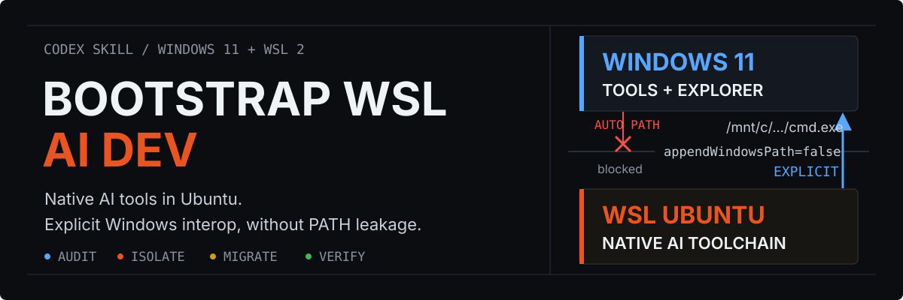
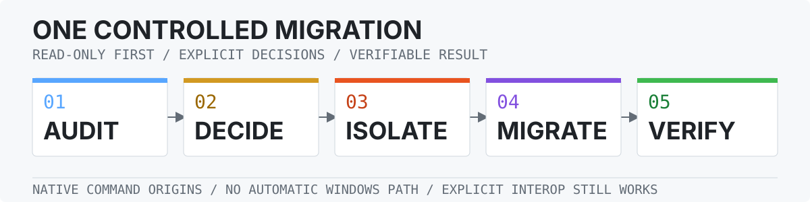

<h1 align="center">
  
</h1>

<p align="center">
  <a href="https://github.com/CaoLiangqiang/bootstrap-wsl-ai-dev/actions/workflows/lint.yml"></a>
  <a href="https://github.com/CaoLiangqiang/bootstrap-wsl-ai-dev/releases/latest"></a>
  <a href="LICENSE"></a>
</p>

`bootstrap-wsl-ai-dev` is an audit-first Agent Skill for building the Phase 1 WSL foundation used by native AI development. It combines Codex-guided decisions with deterministic Bash and PowerShell scripts; it is not a daemon, binary, or npm runtime package. Windows tools can remain installed while WSL command resolution, user startup, system services, native developer tools, and optional interoperability are configured and verified independently.

## Start here

Install the skill globally for Codex from inside WSL:

```bash
npx skills add CaoLiangqiang/bootstrap-wsl-ai-dev \
  --skill bootstrap-wsl-ai-dev \
  --agent codex \
  --global \
  --yes
```

Start a new Codex turn, then run the read-only audit:

```text
Use $bootstrap-wsl-ai-dev to audit my Windows and WSL AI development environment.
```

The workflow asks for explicit decisions before changing PATH isolation, Windows registry state, packages, credentials, Docker, or networking.

## Product shape

The release is one repository-native Skill with explicit ownership boundaries:

| Layer | Delivered implementation |
| --- | --- |
| Skill controller | [`SKILL.md`](SKILL.md) tells Codex what to inspect, which user decisions are required, and which script or reference owns each operation. |
| Read-only audit | Bash and PowerShell inventories classify workspace placement, command origins, shell state, Windows applications, network readiness, and migration results without printing credentials. |
| WSL user layer | Reversible scripts create `~/src`, add an owned `~/.local/bin` PATH block, and optionally install `win-open` and `win-clip` wrappers that call absolute Windows paths. |
| WSL distro layer | Separate root-reviewed scripts manage only `[interop] appendWindowsPath=false`, `[boot] systemd=true`, and `[user] default=USER`; unrelated and network sections are preserved. |
| Native toolchain | References and scripts cover Git/SSH, AI CLI migration, network diagnosis, Docker Engine, daemon proxy configuration, and post-restart verification. |
| Windows user layer | Optional PowerShell operations inventory Windows AI tools and manage owned Explorer verbs under `HKCU` with collision checks and rollback, without UAC. |
| Prompt add-on | Delegate an optional Starship Catppuccin Powerline setup across WSL and Windows without duplicating fonts or configuration logic. |
| Verification | Linux fixture tests, Windows PowerShell registry tests, ShellCheck, Skill discovery, and GitHub Actions validate the same repository content shipped to consumers. |

This is the Phase 1 foundation. LAN SSH serving is deliberately excluded: the companion `$bootstrap-wsl-server` Phase 2 owns `sshd`, `authorized_keys`, Windows `portproxy`, firewall rules, startup tasks, and server manuals. Complete the [foundation-to-server contract](references/wsl-server-extension-contract.md) before that handoff.

After the startup and systemd preflight, the core migration remains a five-stage workflow:

<p align="center">
  
</p>

1. **Audit** the current machine without changing it.
2. **Decide** which tools stay on Windows, move to WSL, or are removed.
3. **Isolate** command resolution without touching WSL networking.
4. **Migrate** selected tools into native Linux paths and private state.
5. **Verify** native origins, expected absence, and deliberate interoperability.

## The boundary

The native WSL setting is intentionally narrow:

```ini
[interop]
appendWindowsPath=false
```

This prevents Windows directories and command shims from being imported into the WSL `PATH`. It does not disable WSL interoperability, so an explicitly addressed Windows executable under `/mnt/c/...` can still be used for a deliberate Windows-side operation.

| Automatic behavior | Explicit behavior |
| --- | --- |
| `cmd.exe`, `powershell.exe`, npm shims, and other Windows commands do not appear in normal WSL lookup. | `/mnt/c/Windows/System32/cmd.exe` and other absolute Windows paths remain available when intentionally invoked. |
| PATH isolation does not edit Clash, proxy, DNS, NAT, mirrored networking, or Docker settings. | Network and Docker configuration remain separate user decisions. |

## Startup baseline

For a new or inconsistent WSL shell, follow the [WSL startup baseline](references/wsl-startup-baseline.md). Its audit is read-only; its installer manages only `~/src`, `~/.local/bin`, and owned blocks in `.profile` and `.bashrc`; removal preserves user directories and files. Optional `win-open` and `win-clip` wrappers retain deliberate Explorer and clipboard access without restoring Windows directories to `PATH`.

## Optional Starship prompt

The optional adapter delegates to the independently released `setup-starship-catppuccin` Skill instead of copying its theme, fonts, or platform installers. That Skill owns Starship installation, profile backups, Windows Terminal JSON updates, validation, and rollback; Windows changes still require explicit approval. Follow the pinned dependency installation and read-only entry point in [Starship prompt integration](references/starship-terminal-prompt.md).

## Optional Explorer integration

The Windows-side add-on creates owned per-user shell verbs under `HKCU:\Software\Classes` for both directory backgrounds and selected folders:

| Entry | Launch path | Result |
| --- | --- | --- |
| Open in WSL | `wsl.exe -d <distribution> --cd <directory>` | Enters the selected WSL distribution directly. |
| Open in Windows Terminal | `wt.exe -p <profile> -d <directory>` | Opens the directory with the selected Terminal profile and appearance. |

Installation validates `wsl.exe`, the exact distribution, `wt.exe`, and the exact Terminal profile before writing. Registry updates use ownership checks, collision protection, and rollback snapshots. The feature does not require administrator elevation and does not weaken WSL PATH isolation.

The Windows 11 classic context-menu override is a separate explicit opt-in. It uses undocumented compatibility behavior and may stop working after an operating-system update. See [Explorer integration](references/windows-explorer-wsl.md) for status, installation, rollback, and recovery details.

## Requirements

- Windows 11 with WSL 2 and an Ubuntu distribution for the complete workflow.
- Bash and standard Ubuntu command-line tools for WSL scripts.
- Codex with Agent Skills support.
- Git for manual installation, or Node.js `22.20.0` or later with npm for `npx skills` installation and validation.
- Windows PowerShell 5.1 or later for Windows inventory and Explorer integration.
- Windows Terminal only when the optional Terminal launcher is selected.
- The independently released `setup-starship-catppuccin` `v0.1.0` Skill when the optional prompt add-on is selected.

Run the skill from the Linux filesystem inside WSL. `v0.2.0` supports Windows 11, WSL 2, Ubuntu, Bash, and Windows PowerShell 5.1. Other distributions, Windows versions, shells, and terminal hosts may work but are not release-qualified.

## Other installation methods

<details>
<summary><strong>Codex skill installer</strong></summary>

Ask Codex:

```text
Use $skill-installer to install bootstrap-wsl-ai-dev from
https://github.com/CaoLiangqiang/bootstrap-wsl-ai-dev,
using the repository root as the skill path.
```

The installer should use `.` as the repository path and `bootstrap-wsl-ai-dev` as the destination name. Start a new Codex turn after installation.

</details>

<details>
<summary><strong>Git</strong></summary>

```bash
skill_root="${CODEX_HOME:-$HOME/.codex}/skills"
mkdir -p "$skill_root"
git clone https://github.com/CaoLiangqiang/bootstrap-wsl-ai-dev.git \
  "$skill_root/bootstrap-wsl-ai-dev"
```

Update an existing Git installation with:

```bash
git -C "${CODEX_HOME:-$HOME/.codex}/skills/bootstrap-wsl-ai-dev" pull --ff-only
```

Do not overwrite an existing destination that contains local changes. Inspect it with `git status` first.

</details>

Preview the skill without installing it:

```bash
npx skills add CaoLiangqiang/bootstrap-wsl-ai-dev --list
```

Update a global `npx skills` installation:

```bash
npx skills update bootstrap-wsl-ai-dev --global --yes
```

`npx skills` installs the shared Codex target under `~/.agents/skills/bootstrap-wsl-ai-dev`.

Start a new Codex turn after installation or update so the current skill state is discovered.

## Repository map

| Path | Authority |
| --- | --- |
| [`SKILL.md`](SKILL.md) | Workflow, safety decisions, and resource routing. |
| [`scripts/`](scripts) | Deterministic Bash and PowerShell operations. |
| [AI CLI migration](references/ai-cli-migration.md) | Native toolchain and per-tool migration guidance. |
| [Windows cleanup](references/windows-ai-cleanup.md) | Read-only inventory and per-workstation target matrix. |
| [Explorer integration](references/windows-explorer-wsl.md) | Launcher installation, status, rollback, and Windows 11 behavior. |
| [WSL startup baseline](references/wsl-startup-baseline.md) | User-only startup setup, explicit interop wrappers, rollback, and deferred host settings. |
| [Starship prompt integration](references/starship-terminal-prompt.md) | Optional adapter, standalone Skill discovery, scope, and restart behavior. |
| [Server extension contract](references/wsl-server-extension-contract.md) | Phase 1/Phase 2 ownership and handoff checks. |
| [Official sources](references/sources.md) | Version-sensitive primary documentation. |
| [`CHANGELOG.md`](CHANGELOG.md) | Released user-facing changes. |

## Validate the repository

```bash
bash -n scripts/*.sh tests/*.sh
shellcheck -x scripts/*.sh tests/*.sh
for test_file in tests/test-*.sh; do bash "$test_file"; done
npx --yes skills@1.5.21 add . --list
python3 "${CODEX_HOME:-$HOME/.codex}/skills/.system/skill-creator/scripts/quick_validate.py" .
```

The Skill Creator check is available when Codex's system skills are installed. GitHub Actions also parses every PowerShell script and runs the Explorer integration tests against disposable Windows registry roots.

## License

Released under the [MIT License](LICENSE).
